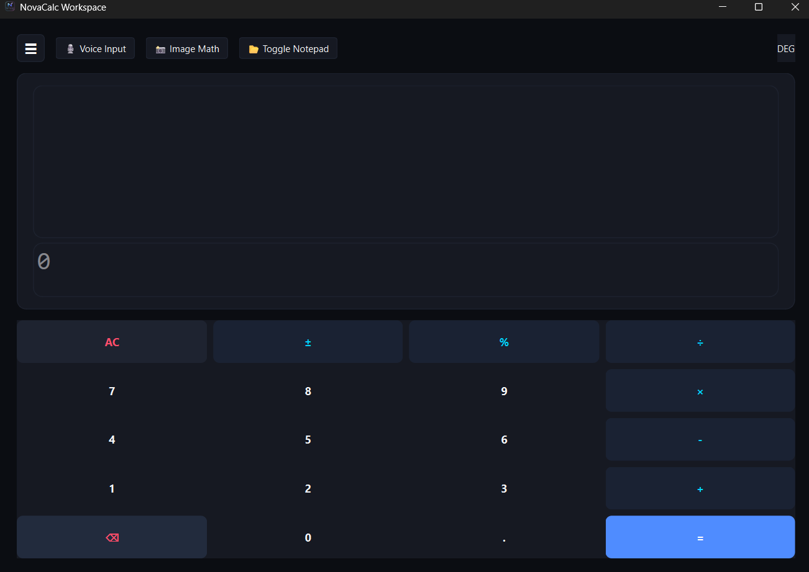
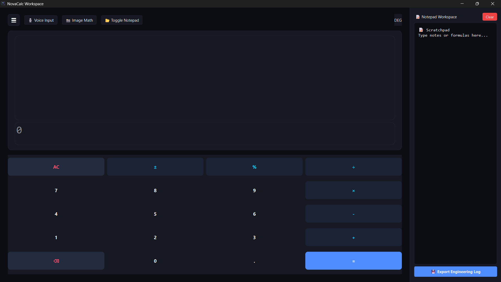
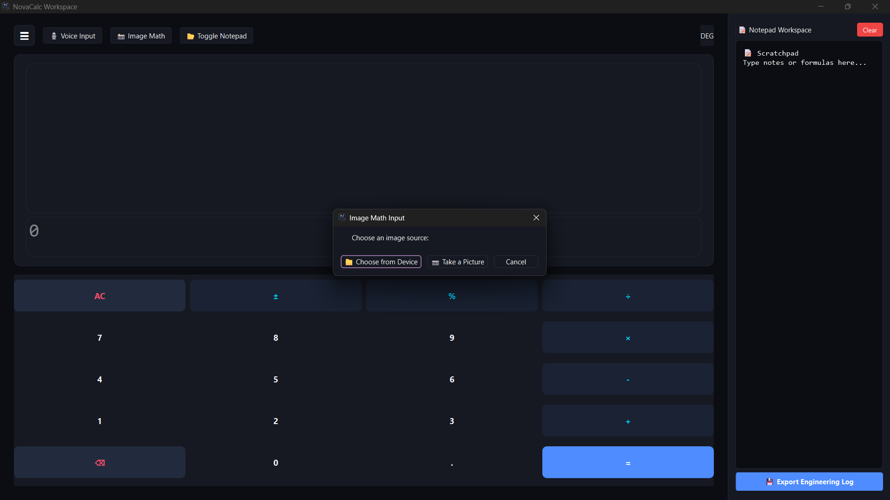
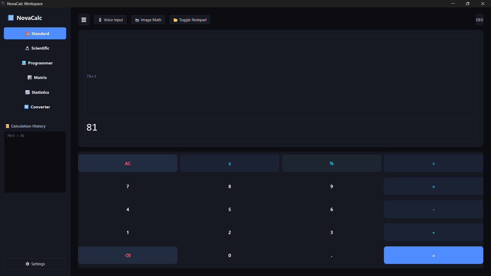
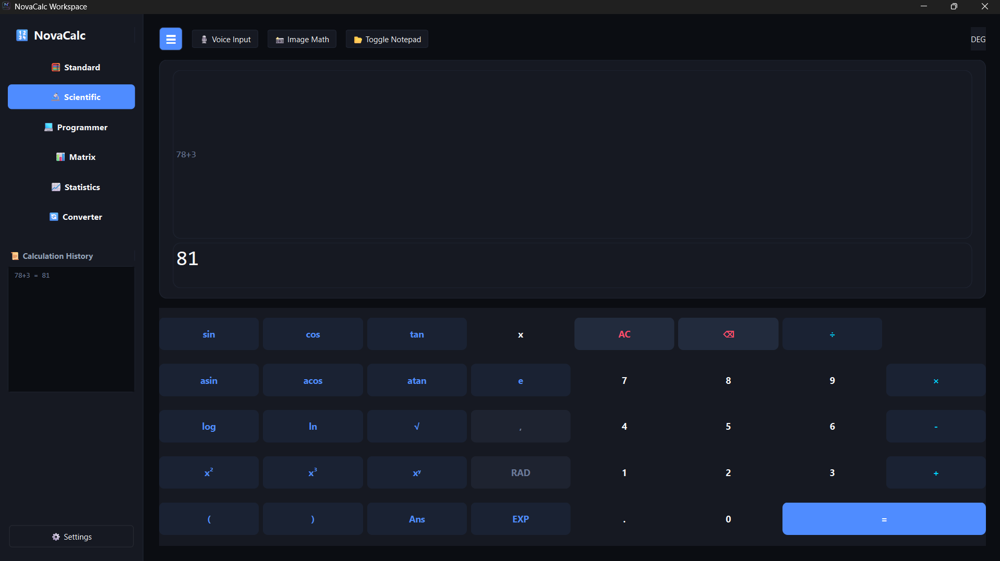
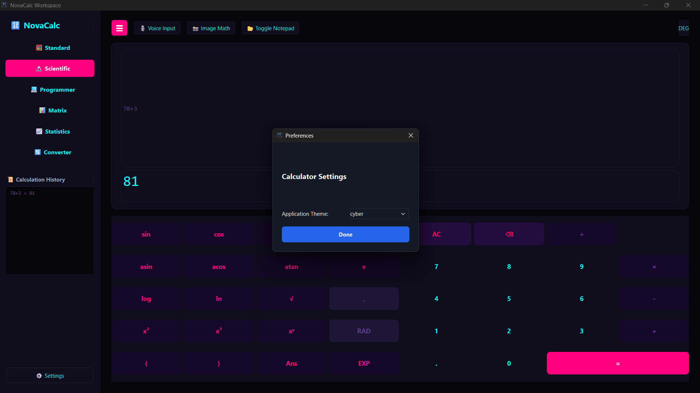
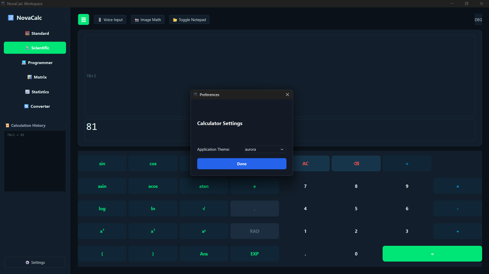
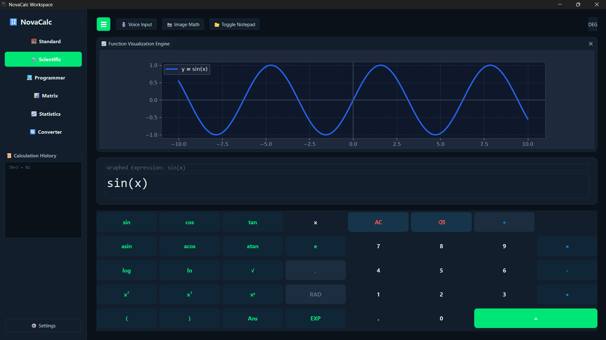

# NovaCalc

A modern desktop calculator built with Python and PySide6.

## ✨ Features

- Standard Calculator
- Scientific Calculator
- Programmer Mode
- Matrix Calculator
- Statistics Calculator
- Unit Converter
- Workspace Notes
- Calculator History
- Modern Dark UI
- Smooth Animations

## 🖼️ Screenshots

















---

## 🛠️ Built With

- Python 3.13
- PySide6
- Qt Style Sheets (QSS)

## 🚀 Installation

```bash
git clone https://github.com/GIRIDHAR-01/NovaCalc.git

cd NovaCalc

pip install -r requirements.txt

python main.py
```

## 📄 License

This project is licensed under the MIT License.